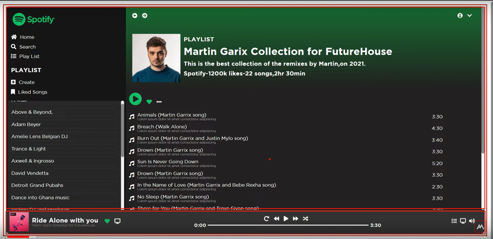

# Spotify_Clone_Web_Design

Design a Spotify clone Web design using HTML and CSS

## Aim of the Project :

Improve my skills in front-end development like **HTML & CSS**

### The main feature of this website are:

- responsive header section with search box, navbar toggle and shopping cart box.
- responsive home section using css flexbox.
- responsive about section using css flexbox.
- responsive menu card section using css grid.
- responsive products card section using css grid.
- responsive review / testimonial card section using css grid.
- responsive contact form section using css grid.
- responsive blogs / news card section using css grid.
- responsive footer section.

#### Sections(Layout):

- Play list(left - Vertical)
- Playing section(Right - Horizontal)
- Music Player section(bottom - Horizontal)
- Spotify Layout Design 
  

1. Make Full container
2. Divide two parts the full container
3. Divide two parts the top container

Refferences :

<A href= "https://youtu.be/weWqXzScjQU?si=W1pFRGPK3kezUsiS"> Adomic Arts - Spotify clone </a>
